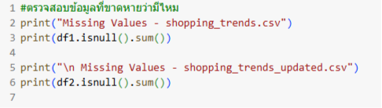
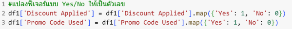
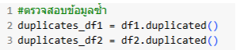
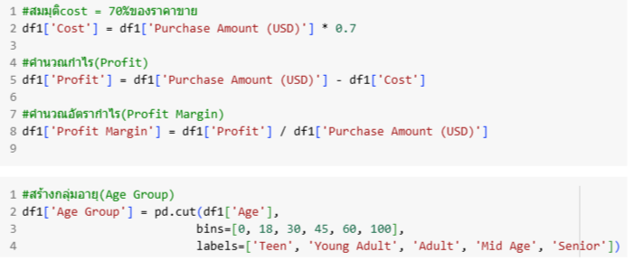
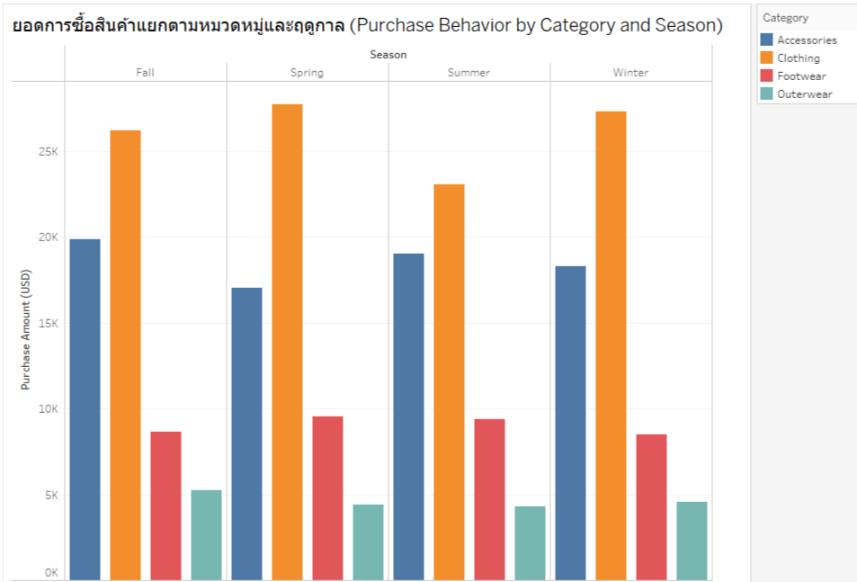
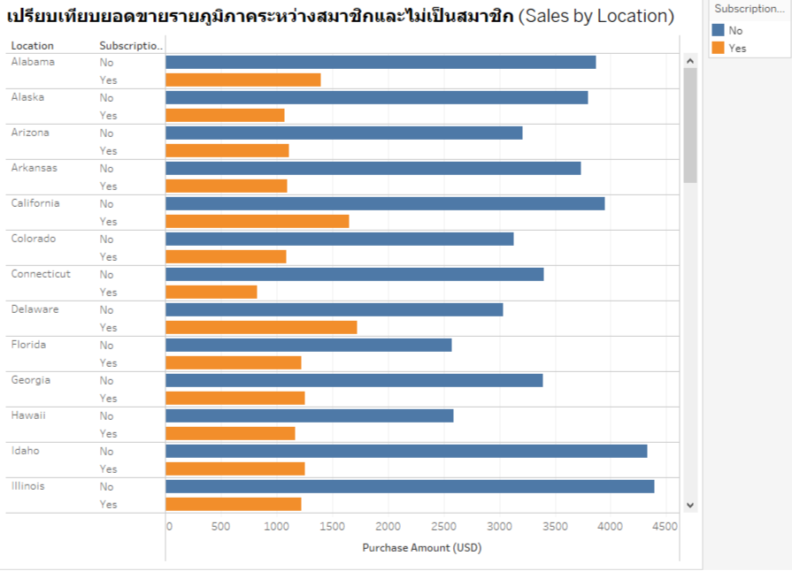
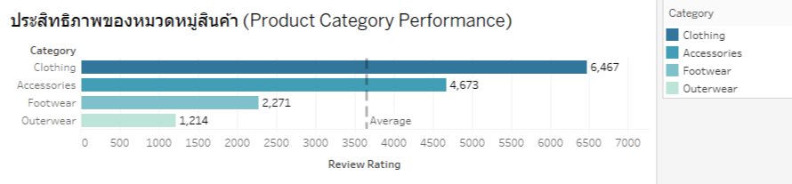
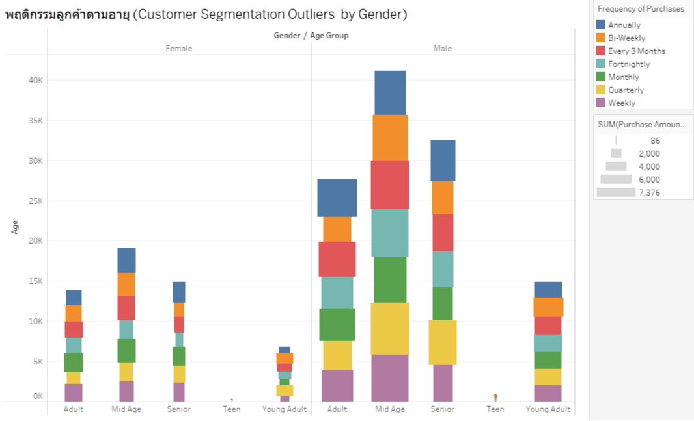

# Project-CP372-G.2
โปรเจค รายวิชา CP372 Data Analytics and Business Intelligence

Dataset: Customer Shopping Trends Dataset

สมาชิก

65102010112  นาย ณัฐกร เกิดมั่งมี

65102010123 นาย พัฒนพงศ์ สุริยวงษ์ปรี

65102010193 นาย เดชดำรง ปาลกะวงศ์ ณ อยุธยา

---

## 1. Project Canvas
  

## 2. การเตรียมข้อมูล (Data Preparation)
- **2.1 การทำความสะอาดข้อมูล (Data Cleaning) ในขั้นตอนนี้ ได้มีการตรวจสอบและจัดการกับปัญหาที่อาจส่งผลกระทบต่อการวิเคราะห์ข้อมูล ได้แก่:**  
    - ค่าที่ขาดหาย (Missing Values): จากการตรวจสอบข้อมูลไม่พบค่าที่ขาดหายใน dataset
      
    - แปลงฟีเจอร์แบบ Yes/No ให้เป็นตัวเลข เพราะให้เหมาะสมแก่การใช้งานมากขึ้น
      
    - ข้อมูลซ้ำ (Duplicate Data): มีการตรวจสอบข้อมูลซ้ำ และลบแถวที่ซ้ำซ้อนออก

      
- **2.2 การสร้างคุณลักษณะใหม่ (Feature Engineering)มีการสร้างฟีเจอร์ใหม่หลายรายการเพื่อเพิ่มความสามารถในการวิเคราะห์ข้อมูล โดยมีรายละเอียดดังนี้:**
    - Cost: คำนวณต้นทุนโดยสมมุติให้ต้นทุนเป็น 70% ของยอดซื้อ (Cost = Purchase Amount × 0.7)
    - Profit: กำไร = ยอดซื้อ − ต้นทุน (Profit = Purchase Amount − Cost)
    - Profit Margin: อัตรากำไร = กำไร / ยอดซื้อ (Profit Margin = Profit / Purchase Amount)
    - Age Group: จำแนกกลุ่มอายุตามช่วง เช่น Teen, Young Adult, Adult, Mid Age, และ Senior
      
    - High Spender: ผู้ที่มียอดใช้จ่ายมากกว่า 100 ดอลลาร์สหรัฐ
    - Loyal Customer: ลูกค้าที่เคยซื้อซ้ำตั้งแต่ 5 ครั้งขึ้นไป
    - Discount Applied & Promo Code Used: แปลงค่าประเภท Yes/No ให้เป็นค่าตัวเลข (1 = Yes, 0 = No)
    - Preferred Payment Match: ตรวจสอบว่าวิธีการชำระเงินจริงตรงกับวิธีที่ลูกค้าต้องการหรือไม่ (1 = ตรง, 0 = ไม่ตรง)
-**2.3 เอกสารประกอบ (Documentation)**
    - ขั้นตอนการเตรียมข้อมูลทั้งหมดถูกจัดทำใน Jupyter Notebook อย่างเป็นระบบ โดยประกอบด้วย:
    - โค้ด Python พร้อมคำอธิบายเป็น Markdown
    - ขั้นตอนการทำความสะอาดข้อมูล และสร้างคุณลักษณะใหม่
    - ใช้ library เช่น pandas, numpy, และ matplotlib เพื่อการจัดการข้อมูลและแสดงผล
    - สามารถอ้างอิงได้จากไฟล์แนบ Shopping_Trends_Data_Preparation.ipynb

## 3. การสำรวจข้อมูลเบื้องต้น (Exploratory Data Analysis, EDA)
  
  
**3.1 กราฟ: ยอดการซื้อสินค้าแยกตามหมวดหมู่และฤดูกาล** 
    - กราฟนี้แสดงยอดการซื้อสินค้ารวม (Purchase Amount) แยกตามหมวดหมู่สินค้า ได้แก่ Accessories, Clothing, Footwear และ Outerwear ภายใต้แต่ละฤดูกาล คือ Fall, Spring, Summer และ Winter

- ในส่วนของ Key Patterns
    - Clothing เป็นหมวดหมู่ที่ทำยอดขายสูงที่สุดในทุกฤดูกาลโดยเฉพาะในฤดูใบไม้ผลิ (Spring) และฤดูหนาว (Winter) ที่ยอดขายเกิน 27,000 USD แสดงให้เห็นว่าผู้บริโภคให้ความสำคัญกับการซื้อเสื้อผ้าในช่วงเปลี่ยนฤดูและฤดูที่อากาศเย็น
    - Accessories ทำยอดขายได้อย่างสม่ำเสมอโดยเฉพาะในฤดูใบไม้ร่วง (Fall) และฤดูร้อน (Summer) สะท้อนให้เห็นว่าเครื่องประดับเป็นสินค้าที่ได้รับความนิยมตลอดทั้งปี
    - Footwear และ Outerwear มียอดขายต่ำที่สุดในทุกฤดูกาล Outerwear มีแนวโน้มยอดขายต่ำมากในฤดูร้อน (ต่ำกว่า 5,000 USD) สอดคล้องกับสภาพอากาศที่ไม่จำเป็นต้องใช้เสื้อกันหนาว
 
- ในส่วนของ Irregularities
    - Outerwear ในฤดูใบไม้ร่วง (Fall) มียอดซื้อต่ำผิดคาด แม้อากาศจะเริ่มเย็น
    - Footwear ในฤดูหนาว (Winter) มียอดขายต่ำกว่าที่คาดไว้ แม้จะเป็นฤดูที่รองเท้าอุ่นน่าจะขายดี
    - ช่องว่างระหว่างหมวด Clothing กับหมวดอื่นๆ ค่อนข้างมาก ในบางฤดู เช่น Spring ที่ Clothing มียอดขายเกือบ 28,000 USD แต่ Outerwear ไม่ถึง 5,000 USD
  
  

**3.2 กราฟ: ความสัมพันธ์ระหว่างส่วนลดกับยอดซื้อ**
  - กราฟนี้เป็น Scatter Plot แสดงความสัมพันธ์ระหว่าง ยอดซื้อ (Purchase Amount) บนแกน X และ ส่วนลดที่ใช้ (Discount Applied) บนแกน Y โดยแบ่งตามกลุ่มอายุ (Age Group) และแสดงขนาดเสื้อผ้า (Size) ที่จุดข้อมูลแต่ละจุด

  - ในส่วนของ Key Patterns
    - มีความสัมพันธ์เชิงบวกระหว่างยอดซื้อและส่วนลดโดยทั่วไปแล้ว เมื่อยอดซื้อเพิ่มขึ้น ส่วนลดที่ได้รับก็มักจะสูงขึ้นตาม ซึ่งเป็นแนวโน้มที่สมเหตุสมผลในเชิงกลยุทธ์การตลาด
    - กลุ่มอายุ Young Adult และ Teen มียอดซื้อมากและได้รับส่วนลดสูงจุดข้อมูลที่มีส่วนลดมากกว่า 150 และยอดซื้อสูงกว่า 20,000 USD ส่วนใหญ่มาจากกลุ่ม Young Adult (สีเขียว) และ Teen (สีแดง) ซึ่งอาจสะท้อนถึงการมีกำลังซื้อสูง หรือได้รับโปรโมชันเฉพาะกลุ่ม
    - ขนาดเสื้อผ้าที่ขายดีในยอดซื้อสูงมักอยู่ที่ไซส์ M และ L จุดที่มียอดซื้อสูงสุดและส่วนลดสูงแสดงขนาดเสื้อผ้า M และ L เป็นหลัก
    - กลุ่ม Adult และ Mid Age มีการกระจายอยู่ในช่วงยอดซื้อต่ำถึงกลางซึ่งอาจบ่งบอกว่ากลุ่มวัยทำงานมีแนวโน้มซื้อสินค้าบ่อยครั้งแต่ยอดซื้อแต่ละครั้งไม่สูงมากนัก
 
- ในส่วนของ Irregularities
    - มีบางจุดที่ได้ส่วนลดสูงแต่ยอดซื้อต่ำ (เช่น จุดกลุ่ม Teen ที่ยอดซื้อราว 8,000 แต่ได้ส่วนลดเกิน 80) ซึ่งอาจเป็นผลจากโปรโมชันเฉพาะกลุ่มหรือความผิดปกติในการกำหนดส่วนลด
    - มีบางจุดที่ได้ส่วนลดน้อยมาก แม้ยอดซื้อค่อนข้างสูง อาจเป็นไปได้ว่าลูกค้ากลุ่มนั้นไม่เข้าร่วมแคมเปญส่วนลด หรือซื้อสินค้าที่ไม่มีโปรโมชัน
      
  

**3.3 กราฟ: เปรียบเทียบยอดขายรายภูมิภาคระหว่างสมาชิกและไม่เป็นสมาชิก**
  - กราฟนี้แสดงยอดขาย (Purchase Amount) ในแต่ละรัฐของสหรัฐอเมริกา โดยแยกตามสถานะการสมัครสมาชิก (Subscription Status)
    - สีส้ม: ลูกค้าที่ สมัครสมาชิก (Yes)
    - สีน้ำเงิน: ลูกค้าที่ ไม่ได้สมัครสมาชิก (No)
  - ในส่วนของ Key Patterns
      - กำไรส่วนใหญ่มาจากลูกค้าที่ไม่ได้สมัครสมาชิก ในเกือบทุกรัฐ/พื้นที่ กำไรส่วนใหญ่ (แท่งสีแดง) มาจากลูกค้าที่ "ไม่ได้สมัครสมาชิก" (Subscription Status: No) ซึ่งบ่งชี้ว่าฐานลูกค้าหลักที่สร้างกำไรยังคงเป็นลูกค้าทั่วไป
  - ในส่วนของ Irregularities
      - กำไรจากลูกค้าที่สมัครสมาชิกค่อนข้างน้อยในภาพรวม แม้ว่าจะมีลูกค้าที่สมัครสมาชิกในหลายรัฐ แต่สัดส่วนกำไรที่มาจากกลุ่มนี้ยังน้อยมากเมื่อเทียบกับลูกค้าที่ไม่ได้สมัครสมาชิก นี่อาจเป็นความผิดปกติหากธุรกิจมีเป้าหมายที่จะเพิ่มรายได้และกำไรจากฐานลูกค้าสมาชิก ซึ่งหมายความว่าอาจมีโอกาสในการปรับปรุงกลยุทธ์การสมัครสมาชิกหรือการมอบสิทธิประโยชน์เพื่อดึงดูดการซื้อจากกลุ่มลูกค้าเหล่านี้ให้มากขึ้น
        
  

**3.4 กราฟ: ประสิทธิภาพของหมวดหมู่สินค้า**
- กราฟนี้เป็นแผนภูมิแท่งแนวนอน (Horizontal Bar Chart) แสดงผลรวมคะแนนรีวิว (Review Rating) แยกตามหมวดหมู่สินค้า ได้แก่ Clothing, Accessories, Footwear, และ Outerwear โดยความยาวของแท่งแสดงถึงยอดรวมของคะแนนรีวิวแต่ละกลุ่ม พร้อมเส้นค่าเฉลี่ย (Average) เพื่อใช้เปรียบเทียบกับภาพรวม
- ในส่วนของ Key Patterns
  - Clothing มีคะแนนรีวิวรวมสูงสุด (6,467 คะแนน) สะท้อนความนิยมของสินค้ากลุ่มนี้
  - Accessories และ Footwear อยู่ในระดับกลาง โดย Accessories สูงกว่าค่าเฉลี่ย
  - Outerwear มีคะแนนรีวิวน้อยที่สุด (1,214 คะแนน) ต่ำกว่าค่าเฉลี่ยมาก อาจเกิดจากการเป็นสินค้าตามฤดูกาล หรือยอดขายต่ำ
  - ความแตกต่างระหว่างหมวดหมู่มีนัยสำคัญ โดย Clothing ได้คะแนนมากกว่า Outerwear ถึง 5 เท่า
- ในส่วนของ Irregularities
  - สินค้าบางกลุ่ม เช่น Outerwear มีคะแนนรีวิวต่ำกว่าค่าเฉลี่ยอย่างเห็นได้ชัด อาจต้องพิจารณาปรับกลยุทธ์การตลาดหรือโปรโมชัน
  - ยังไม่มีการแบ่งช่วงเวลา (Time Series) หรือ Sub-category ซึ่งอาจช่วยในการวิเคราะห์เชิงลึก
    
  

**3.5 กราฟ: พฤติกรรมลูกค้าตามอายุและเพศ**
- กราฟนี้เป็น Stacked Bar Chart แสดงพฤติกรรมการซื้อของลูกค้า แยกตามกลุ่มอายุ (Age Group) และเพศ (Gender) โดยใช้ ยอดซื้อรวม (Total Purchase Amount) เป็นแกน Y และจำแนกความถี่ในการซื้อ (Frequency of Purchases) ด้วยสีในแต่ละแท่ง โดยมีการแยกฝั่ง ชาย (Male) และ หญิง (Female)
- ในส่วนของ Key Patterns
  - เพศชายในกลุ่ม Mid Age (วัยกลางคน) มียอดซื้อรวมสูงที่สุดจากทุกกลุ่ม แสดงถึงการเป็นกลุ่มลูกค้าที่มีกำลังซื้อสูงและมีความถี่ในการซื้อหลากหลาย
  - กลุ่มชายสูงวัย (Senior Male) และ ชายวัยทำงาน (Adult Male) ก็มียอดซื้อสูงเช่นกัน โดยเฉพาะการซื้อแบบรายสัปดาห์ (Weekly) และรายเดือน (Monthly) สะท้อนพฤติกรรมการซื้ออย่างสม่ำเสมอ
  - เพศหญิงในทุกช่วงอายุ มียอดซื้อน้อยกว่าฝั่งชายในกลุ่มอายุเดียวกัน โดยเฉพาะในกลุ่ม Adult และ Senior
  - กลุ่มวัยรุ่น (Teen) ทั้งชายและหญิง มียอดซื้อน้อยที่สุด ซึ่งอาจเกิดจากกำลังซื้อจำกัด หรือไม่มีอำนาจในการตัดสินใจซื้อสินค้าเอง
  - กลุ่ม Young Adult (20–30 ปี) ทั้งสองเพศ มีการซื้อค่อนข้างสม่ำเสมอ แม้ยอดรวมจะไม่สูงเท่ากลุ่มอื่น แต่มีความถี่แบบรายสัปดาห์/รายเดือนเด่นชัด
- ในส่วนของ Irregularities
  - กลุ่มผู้หญิงวัยกลางคน (Mid Age Female) มีความถี่ในการซื้อหลายประเภท แต่ยอดรวมยังน้อยกว่าชายกลุ่มเดียวกันมาก อาจมีข้อจำกัดด้านงบประมาณหรือสินค้าไม่ตรงกลุ่มเป้าหมาย
  - Teen Female และ Teen Male มีการซื้อแบบ “รายเดือน/ราย 3 เดือน” แทนที่จะเป็นรายสัปดาห์ ซึ่งอาจเกิดจากการรับสินค้าในช่วงโปรโมชันเท่านั้น
 
## 4. การวิเคราะห์เชิงลึก (In-Depth Analysis)
**4.1 ปัจจัยใดส่งผลต่อความแปรปรวนของกำไร (Profit) มากที่สุด**
    
    import pandas as pd
    from sklearn.linear_model import LinearRegression
    from sklearn.model_selection import train_test_split
    from sklearn.metrics import r2_score
    from sklearn.preprocessing import LabelEncoder
    
    #โหลดข้อมูล
    df = pd.read_csv("shopping_trends_updated.csv")
    
    #Feature Engineering
    df['Cost'] = df['Purchase Amount (USD)'] * 0.7
    df['Profit'] = df['Purchase Amount (USD)'] - df['Cost']
    df['Profit Margin'] = df['Profit'] / df['Purchase Amount (USD)']
    
    #Label Encoding สำหรับคอลัมน์ที่เป็นข้อความ
    le = LabelEncoder()
    
    #แปลงค่าที่เป็นข้อความให้เป็นตัวเลข
    df['Frequency of Purchases'] = le.fit_transform(df['Frequency of Purchases'])
    df['Promo Code Used'] = le.fit_transform(df['Promo Code Used'])
    df['Discount Applied'] = le.fit_transform(df['Discount Applied'])
    
    #สร้างตัวแปรสำหรับโมเดล
    X = df[['Age', 'Frequency of Purchases', 'Discount Applied', 'Promo Code Used']]
    y = df['Profit']
    
    #แบ่งข้อมูล
    X_train, X_test, y_train, y_test = train_test_split(X, y, test_size=0.2, random_state=42)
    
    #เทรนโมเดล
    model = LinearRegression()
    model.fit(X_train, y_train)
    
    #ทำนายและประเมินผล
    y_pred = model.predict(X_test)
    
    #R-squared
    print(f"R-squared: {r2_score(y_test, y_pred):.4f}\n")
    
    #Coefficients
    print("Coefficients:")
    for name, coef in zip(X.columns, model.coef_):
        print(f"  {name}: {coef:.4f}")
        
**- ผลลัพธ์การวิเคราะห์เชิงลึก ข้อ4.1**
  - ค่า R² : -0.0088 แสดงให้เห็นว่า ตัวแปรเหล่านี้ ไม่ใช่ตัวทำนายที่ดี สำหรับกำไร ในชุดข้อมูลนี้
- ค่าสัมประสิทธิ์ (Coefficients):
  - Age : -0.0060
  → อายุสูงขึ้น 1 ปี กำไรลดลงเฉลี่ยประมาณ 0.006 USD (น้อยมากจนไม่มีนัยสำคัญ)
  - Frequency of Purchases : -0.1068
  → ยิ่งซื้อถี่ กำไรเฉลี่ยต่อคำสั่งซื้อลดลง อาจเป็นเพราะลูกค้าที่ซื้อบ่อยซื้อของราคาต่ำหรือใช้ส่วนลดบ่อย
  - Discount Applied : -0.0514
  → การใช้ส่วนลดมีผลลดกำไรลงเล็กน้อย
  - Promo Code Used : -0.0514
  → เช่นเดียวกัน การใช้โค้ดโปรโมชันก็ลดกำไรเล็กน้อย

**4.2 กลุ่มลูกค้าแบบใดมีแนวโน้มซื้อซ้ำ (Loyal Customers) มากที่สุด**

        from sklearn.linear_model import LogisticRegression
        from sklearn.preprocessing import LabelEncoder
        
        # เตรียมข้อมูล
        df['Loyal Customer'] = df['Previous Purchases'] >= 5
        df['Loyal Customer'] = df['Loyal Customer'].astype(int)
        
        # Encode ตัวแปรกลุ่มคำ
        df['Subscription Status'] = LabelEncoder().fit_transform(df['Subscription Status'])
        df['Gender'] = LabelEncoder().fit_transform(df['Gender'])
        
        X = df[['Age', 'Subscription Status', 'Gender', 'Discount Applied']]
        y = df['Loyal Customer']
        
        X_train, X_test, y_train, y_test = train_test_split(X, y, test_size=0.2, random_state=42)
        
        model = LogisticRegression()
        model.fit(X_train, y_train)
        
        print(f"Accuracy: {model.score(X_test, y_test):.4f}")
        print("Coefficients:")
        for feature, coef in zip(X.columns, model.coef_[0]):
            print(f" - {feature:}: {coef:.4f}")
            
**- ผลลัพธ์การวิเคราะห์เชิงลึก ข้อ4.2**
  - ค่า Accuracy : 0.9231 โมเดลทำนายได้แม่นมากว่าใครเป็นลูกค้าประจำ
- ค่าสัมประสิทธิ์ (Coefficients):
  - Age : 0.0019
  → อายุเพิ่มขึ้น 1 ปี เพิ่มโอกาสเล็กน้อย
  - Subscription Status : 0.4126
  → ลูกค้าที่สมัครสมาชิก มีโอกาสเป็นลูกค้าประจำสูงขึ้น
  - Gender : 0.4789
  → เพศหญิง มีแนวโน้มภักดีมากกว่ากลุ่มอื่น แปลว่าเพศหญิงซื้อซ้ำมากกว่า
  - Discount Applied : 0.5753
  → การใช้ส่วนลดลดโอกาส ที่จะเป็นลูกค้าประจำ

## 5. ข้อค้นพบและข้อเสนอแนะ (Insights & Recommendations)
1. Mid Age Male เป็นกลุ่มลูกค้าที่มีกำลังซื้อสูง แต่ กำไรเฉลี่ยต่อคำสั่งซื้อลดลงตามความถี่ในการซื้อ จาก EDA พบว่า ลูกค้าชายช่วงวัยกลางคน (Mid Age Male) มียอดซื้อรวมสูงที่สุด แต่จาก In-Depth Analysis พบว่า Frequency of Purchases มีความสัมพันธ์เชิงลบกับกำไร (Coefficient: -0.1068) แสดงให้เห็นว่าลูกค้าที่ซื้อบ่อยอาจซื้อสินค้ามูลค่าต่ำหรือใช้ส่วนลดบ่อย ทำให้กำไรเฉลี่ยต่อคำสั่งซื้อลดลง
Recommendation: พัฒนา campaign ที่กระตุ้นให้ลูกค้าซื้อเป็น high-value order แทนการซื้อบ่อย เช่น ซื้อครบ $100 รับ 10% cashback” หรือ “รับของขวัญฟรีเมื่อซื้อเกิน $80 แนวทางนี้ก็ช่วยเพิ่ม AOV (Average Order Value) และ ยังคงระดับกำไรให้สูงได้
2. Non-member ยังเป็นแหล่งกำไรหลัก แต่สมาชิกมีแนวโน้มที่จะเป็น Loyalty สูงกว่า จาก EDA พบว่า ลูกค้าที่ไม่เป็นสมาชิก (Non-member) สร้างกำไรหลักในหลายรัฐแต่ In-Depth Analysis แสดงว่า Subscription Status มี coefficient = +0.4126 นั่นแสดงว่าสมาชิกมีแนวโน้มเป็นลูกค้าประจำมากกว่า
Recommendation: ปรับปรุงระบบสมาชิกเป็น Tiered Membership เช่น Basic / Silver / Gold โดยเพิ่ม incentive ให้สมาชิกใช้จ่ายมากขึ้น เช่น ส่งฟรี, สะสมแต้ม, early access ลดการพึ่งพา discount ตรง ๆ แล้วเปลี่ยนมาใช้ value-added benefits 
3. การใช้ Discount และ Promo Code มีผลลบต่อกำไรและ Customer Loyalty
ในสว่น In-Depth Analysis พบว่า:
Discount Applied = -0.0514 และ Promo Code Used = -0.0514  กำไรลดลง
Discount Applied = -0.5753 ลูกค้ามีแนวโน้มไม่กลับมาซื้อซ้ำ 
ลูกค้าที่ใช้โปรโมชั่นซ้ำอาจไม่ได้เป็น Loyalty จริง และจะซื้อเฉพาะตอนมีดีลเท่านั้น
Recommendation: ใช้โปรโมชั่นแบบ targeted เฉพาะลูกค้าใหม่ หรือใช้เพื่อดึงลูกค้าที่ inactive หลีกเลี่ยงการให้ discount ซ้ำ ๆ กับลูกค้าที่มีแนวโน้มซื้ออยู่แล้ว เปลี่ยนมาใช้ reward system หรือ point-based loyalty program แทนเพื่อรักษา margin

ลิ้งค์ส่งงาน
ไฟล์งานทั้งหมด Canvas,Tableau https://drive.google.com/drive/folders/1AQEhWt6r3nwPkfwQNj8lGJUY0BRB66Ca?usp=sharing

แนบลิงก์ Tableau Public Dashboard : https://public.tableau.com/app/profile/pattanapong.suriyawongpree/viz/cp372-NkPsDp/CustomerShoppingTrendsOverviewDashboard

แนบลิงก์วิดีโอ YouTube : https://www.youtube.com/watch?v=jYdEOQhN9Hc

แนบ URL GitHub Repository : https://github.com/TheCopperCoin03/cp372-NkPsDp

 

 

 

 
